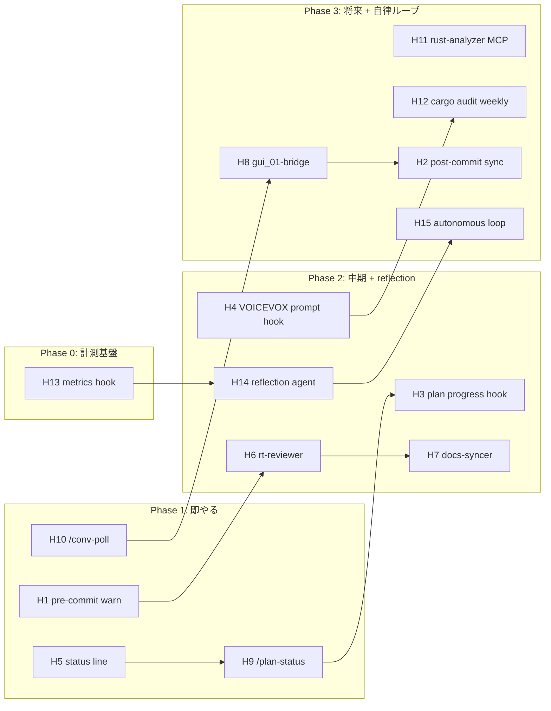

# plan_ahe.md — Agentic Harness Engineering 適用診断レポート

## 0. メタ情報

- **Last-Updated**: 2026-05-05 (v2: 自律改善層を追加)
- **対応 HEAD**: `77a1627`
- **対象**: `F:\dev\daw_01` (Cargo workspace, 4 crate, Rust 製 DAW + VOICEVOX)
- **筆者**: Claude (plan mode で生成、承認済 plan: `~/.claude/plans/agentic-harness-engineering-ethereal-lampson.md`)

### 用語

- **AHE (Agentic Harness Engineering)**: agent そのものではなく、agent を取り巻く周辺システム（hooks / skills / sub-agents / MCP / status line / commands / permissions / memory / plan workflow 等）を継続改善の engineering 対象として扱う考え方。**理想形は harness 自身が観察→反省→改善のループを持つこと**（章 1.5 参照）。
- **Harness**: 本書では `.claude/` 配下の自動化総体 + ユーザー memory + project ドキュメント（CLAUDE.md / docs/plan*.md / docs/gui_01_conversation.md）を指す。
- **Autonomy Level**: harness の自律性レベル（L0〜L4、章 1.5）。
- **Phase**: 本書独自の段階分け（Phase 0/1/2/3）。`plan_a1〜a7` の "Phase A/B" とは独立。

### 本書のスコープ外

- Rust 実装（common / daw_gui / daw_audio / daw_plugin_host のソース）
- ビジネスロジック（DAW の音楽機能、VOICEVOX 連携の仕様）
- UI/UX デザイン
- gui_01 (daw-ui) ライブラリ本体の改修
- L4 完全自律（permission の自動拡張、agent の自動削除等。章 8 で却下）

### 読み方

- **時間が無い人**: 章 1.5（autonomy spectrum）→ 章 3（カタログ）→ 章 5（採点）→ 章 6（ロードマップ）の 4 章で意思決定できる
- **将来の自分**: 章 0〜10 + 付録 A/B を順に読み、phase ごとに発注

---

## 1. Context — なぜ書くか

### 動機

`daw_01` の harness は既に「skill 5 個 + CLAUDE.md 173 行 + memory 25 entries + permissions 84 項目 + plan workflow + gui_01 cross-access」が整備済で、**half-way AHE** の状態にある。一方で次の領域がまだ手付かず：

- **hooks** (PreToolUse / PostToolUse / UserPromptSubmit / Stop) が一切未設定
- **sub-agent** が定義されておらず、skill 内で口頭指示しているのみ
- **MCP server** ゼロ
- **status line** 未設定
- **slash command** は Anthropic 標準のみ
- **scheduled task** 未活用
- **plan.html ↔ git log ↔ gui_01_conversation.md** の三者同期が手動
- **メトリクス計測**ゼロ（何が効いているか定量データなし）
- **reflection / 自己改善ループ**ゼロ

これらをいきなり全部入れる（**全部入り病**）と、複雑化して逆に開発体験を悪化させる。本書は「**何を、いつ、どの順で入れるか**、そして **どこまで自律させるか**」を後で迷わないための診断書。

### AHE の理想と本書の立場

**AHE の理想形は harness 自身の自律改善ループ**である。すなわち：

```
[計測] → [reflection] → [改善提案] → [承認 or 自動適用] → [監査 / ロールバック]
                                                                ↓
                                                            [計測へ戻る]
```

しかし「完全自律」はリスクが高い（暴走、debug 困難、信頼性）。本書は **段階的 autonomy（章 1.5）** を採用し、**L1（人間 in-the-loop）から L3（半自律）まで**を射程に置く。L4 は明示的に却下。

### 反パターン

- 「AHE = 高度なもの」と思って全部追加する（メンテ負荷で破綻）
- ベンチマークなしに hook を追加する（commit が遅くなる）
- gui_01 と無断で連動する hook を入れる（gui_01 側 Claude と整合崩壊）
- MCP / sub-agent を「あるから使う」発想で入れる（skill で十分なケースが多い）
- **計測なしに reflection を回す**（提案の根拠が無く、感覚で振り回される）
- **L4 完全自律を目指す**（permission や agent を自動で書き換えると debug 不能化）

### 成果定義

本書を読み終えた未来の自分（or 別 session の Claude）が、

- カタログ H1〜H15 から 1 つ選んで「これを今 phase に入れる / 入れない」を 5 分で判断できる
- harness の現在 autonomy level を即答できる
- 不採用候補の trigger が発火したら本書を再度開ける
- gui_01 側でも対称構造で `plan_ahe.md` を派生できる

状態を保つ。

---

## 1.5. AHE の autonomy spectrum

### Level 定義

| Level | 内容 | 例 | 判断主体 |
|---|---|---|---|
| **L0** | 全部手動、harness は静的文書のみ | CLAUDE.md だけある状態 | 人間 |
| **L1** | カタログ・ガイドライン提示、人が選んで実装 | 本書 v1（カタログのみ） | 人間 |
| **L2** | 計測 + 提案、軽微な自動適用（log 追記、定型 skill 更新） | H13 メトリクス hook + 手動 reflection | 人間 + 限定的 harness |
| **L3** | observation loop（計測→reflection→提案→人間承認→自動適用）、人間は事後監査 | H14 reflection agent + H15 autonomous loop | harness（提案）+ 人間（承認）|
| **L4** | 完全自律（permission 自動拡張、agent 自動削除、root 設定変更） | (本書では不採用) | harness |

### daw_01 の目標と現在地

- **現在**: L0〜L1 の境界（カタログは整備済、計測なし）
- **目標**: L3 (半自律)。**L4 は安全境界で却下**
- **到達順**: L1 → L2 (Phase 0-1) → L3 (Phase 2-3)

### 自律改善ループの構造（L3 の典型）

```
┌──────────────┐
│  計測層 H13  │  PostToolUse / Stop hook → metrics jsonl
└──────┬───────┘
       │ tool 名 / duration / outcome / error / context size
       ▼
┌──────────────┐
│ reflection   │  H14 sub-agent: log + recent commits + plan_ahe.md を読む
│   H14        │  → 「次にやるべき改善」3 件を提案
└──────┬───────┘
       │ 提案 markdown
       ▼
┌──────────────┐
│ 承認 (人間)  │  ユーザーが採否判断、適用範囲を決める
└──────┬───────┘
       │ approved
       ▼
┌──────────────┐
│ 自動適用     │  軽微なもの（skill 文章修正、メトリクス保管期間延長）は自動
│ or 人間実装  │  重いもの（hook 追加、agent 新設）は人間が実装
└──────┬───────┘
       │
       ▼
┌──────────────┐
│ 監査         │  週次で「先週の提案がどう機能したか」を確認
│ rollback 判定│  失敗していれば撤回
└──────────────┘
       │
       └──→ 計測層へ
```

### 完全自律 (L4) のリスクと却下理由

- harness が permission を自動で拡張する → 意図しない destructive action（rm -rf 等）を許可
- agent を自動で削除 / 改名 → 既存 skill が参照不能化
- settings.json を勝手に書き換える → 「自分が知らない設定」で動き始める、debug 不能
- 個人開発の規模では reliability 面の投資が割に合わない

→ **L4 は不採用**（章 8 に明記）。L3 が個人開発の実用上限。

### 自動適用の安全境界（L2〜L3 の運用）

**自動適用 OK**:
- メトリクス log の rotate / 圧縮
- skill 内の typo 修正
- reflection 提案文の生成（メールや markdown）
- 既存設定のバックアップ作成

**自動適用 NG（人間承認必須）**:
- `.claude/settings.json` の hooks / permissions / mcpServers の変更
- `.claude/agents/*.md` の新設・削除・rename
- skill SKILL.md の構造変更（軽微 typo 以外）
- Rust 本体への変更（本書スコープ外、絶対禁止）
- gui_01 への push（双方向合意が必要）

---

## 2. 現状診断 — 既存資産マップ

### 2.1 資産インベントリ

| 種別 | 場所 | 行数 | 整備度 | 備考 |
|---|---|---|---|---|
| Project CLAUDE.md | `CLAUDE.md` | 173 | ◎ | RT 制約、FFI 安全性、CLAP 仕様、gui_01 アーキ要点 |
| Skill: implement | `.claude/skills/implement/SKILL.md` | 220 | ◎ | 9 ステップ workflow |
| Skill: research-similar-impl | `.claude/skills/research-similar-impl/` | 263 | ◎ | references.md + report-template.md 付き |
| Skill: debug-gui | `.claude/skills/debug-gui/SKILL.md` | 166 | ◎ | 4 層イベント切り分け |
| Skill: debug-plugin-gui | `.claude/skills/debug-plugin-gui/SKILL.md` | 109 | ◎ | CLAP GUI embed の 5 層 IPC |
| Skill: review | `.claude/skills/review/SKILL.md` | 92 | ◎ | RT 安全性 / 性能 / セキュリティ |
| Permissions | `.claude/settings.local.json` | 83 | ◎ | 84 項目 |
| Cross-repo | `.claude/settings.json` | 5 | ○ | gui_01 への additionalDirectories のみ |
| User memory | `~/.claude/projects/.../memory/` | 26 entries | ◎ | language / feedback / project / reference |
| Master plan | `docs/plan.html` | 23 KB | ◎ | M1 完成までの phase マップ |
| Phase plan | `docs/plan_a1〜a7_*.md` | 計 1300+ 行 | ◎ | a1 のみ進行中 |
| Cross-AI 会話 | `docs/gui_01_conversation.md` | 802 | ◎ | `#NNN [Open/Replied/Resolved]` 双方向 |
| Anthropic 系 skill | `~/.claude/skills/anthropic-skills/{consolidate-memory, skill-creator, ...}` | (provided) | ◎ | 自己改善の素材として活用候補 |

### 2.2 不在マップ

| 種別 | 期待されるパス | 現状 | 結果として人力で何をしているか |
|---|---|---|---|
| Hooks | `.claude/settings.json` の `hooks` キー | 空 | 毎 commit 前に手動で `cargo clippy` / `/review` |
| Sub-agent 定義 | `.claude/agents/*.md` | 不在 | skill 内に "Agent 並列起動で..." と口頭指示するのみ |
| カスタム slash command | `.claude/commands/*.md` | 不在 | skill 名を毎回打鍵 |
| MCP server | `.claude/settings.json` の `mcpServers` | 不在 | rust-analyzer 情報は IDE で確認、Claude には grep |
| Status line | `.claude/settings.json` の `statusLine` | 不在 | engine 状態を別ターミナルで `tasklist` |
| Scheduled task | `mcp__scheduled-tasks` 登録 | 0 件 | `cargo audit` を思い出したとき手動 |
| **メトリクス計測** | `~/.claude/projects/.../metrics/*.jsonl` | 不在 | 改善判断は感覚 |
| **reflection 仕組** | `.claude/agents/reflection.md` 等 | 不在 | 自分で振り返る、忘れる |
| **autonomous loop** | scheduled task or wakeup | 不在 | reflection の trigger が無く不定期 |
| CI | `.github/workflows/` | 不在 | 手動。個人開発で Windows のみなので妥当 |

### 2.3 健全性スコア（autonomy level 軸）

```
L0 ──────● L1 ──────── L2 ──────── L3 ──────── L4
         ▲
        現在地（カタログのみ、計測ゼロ）
```

- 知識整理は L1 まで到達
- L2 へ進むには H13 メトリクス hook が起点
- L3 へは H14 reflection + H15 autonomous loop が必要

### 2.4 gui_01 ハーネスとの差分

`gui_01/.claude/` も同様の構成（5 skill、permissions 42 項目、cross-repo daw_01）。違いは：

| 項目 | daw_01 | gui_01 |
|---|---|---|
| Skill 種別 | `debug-gui`（イベント層）| `debug-ui`（widget 描画） |
| Permissions 数 | 84 | 42 |
| Cross-repo | gui_01 を `additionalDirectories` | daw_01 を `additionalDirectories` |
| Conversation 役割 | post 側（質問・要望） | reply 側（実装・回答） |
| autonomy level | L0-L1 | L0-L1（同じ） |

**示唆**: 自律改善層（H13-H15）は gui_01 側にも対称展開可能。**ただし autonomous loop を双方向で回すと干渉リスク**があるため、Phase 3 で慎重に設計（章 9 横展開ポリシー参照）。

---

## 3. 伸びしろカタログ — H1〜H15

各項目の構造: `名称 | 一言 | 主目的 | 触る対象 | 現状の代替手段 | 省力化の差分`

### H1. pre-commit hook (cargo check + clippy + /review)

- **一言**: コミット直前に静的検査と review skill を強制実行
- **主目的**: 安全 + 再現性
- **触る対象**: `.claude/settings.json` (`hooks.PreToolUse`), `scripts/precommit.{sh,ps1}`
- **現状**: ユーザーが手動で `cargo clippy --workspace -- -D warnings`、忘れたら CLAUDE.md を読み返す
- **差分**: clippy 通し忘れがゼロ、`/review` 自動発火で RT 安全性違反が即検出
- **注意**: warn モードで起動

### H2. post-commit hook: gui_01_conversation 同期

- **一言**: daw_01 で `[Open]` を書いた直後に gui_01 へ git diff を転送
- **主目的**: 認知負荷削減
- **触る対象**: `.claude/settings.json`, `scripts/post_conv.{sh,ps1}`
- **現状**: `[Open]` 後、gui_01 側 Claude が気づくまで時差
- **差分**: gui_01 が即座に新規 Open 認識
- **注意**: gui_01 側との合意が必要

### H3. PostToolUse hook: plan.html 進捗自動追記

- **一言**: `Edit`/`Write` で対応 phase 領域を変更したら checklist 自動更新
- **主目的**: 認知負荷削減 + 再現性
- **触る対象**: `.claude/settings.json`, `scripts/plan_progress.{sh,ps1}`
- **現状**: phase 完了時に手動で hash + サマリ追記
- **差分**: 追記漏れ防止、hash 自動取得
- **注意**: 完了判定が難しい、warn モード or "候補表示" が安全

### H4. UserPromptSubmit hook: VOICEVOX 死活確認

- **一言**: a1 関連 prompt で `localhost:50021/version` ping、落ちていれば warning 注入
- **主目的**: 速度
- **触る対象**: `.claude/settings.json`, `scripts/voicevox_check.{sh,ps1}`
- **現状**: VOICEVOX 起動忘れに気づくのは synth 実行時
- **差分**: 実装相談の最初の 1 ターンで気づける
- **注意**: a1 関連かの判定（prompt grep）が必要

### H5. status line: VOICEVOX engine + 直近 build + plan phase

- **一言**: 現 active phase / engine 状態 / 直近 build OK/NG を常時表示
- **主目的**: 認知負荷削減
- **触る対象**: `.claude/settings.json` (`statusLine`), `scripts/statusline.{sh,ps1}`
- **現状**: phase は記憶に頼る、engine は別ターミナル
- **差分**: 状況把握が常時できる
- **注意**: < 100ms で返すこと

### H6. sub-agent: rt-reviewer

- **一言**: cpal callback / lock-free queue / FFI 境界に特化した review 専門 agent
- **主目的**: 安全 + 学習価値
- **触る対象**: `.claude/agents/rt-reviewer.md`
- **現状**: 汎用 `review` skill で RT 観点も含めて review、ノイズが多い
- **差分**: RT 観点だけ深掘り
- **注意**: `review` skill との責務分離

### H7. sub-agent: docs-syncer

- **一言**: plan.html / plan_aN_*.md / CLAUDE.md / conversation の整合性チェック専任
- **主目的**: 再現性
- **触る対象**: `.claude/agents/docs-syncer.md`
- **現状**: 整合性は手動で気を付ける
- **差分**: 矛盾を一括検出
- **注意**: 検出と修正提案は別、修正は人間レビュー後

### H8. sub-agent: gui_01-bridge

- **一言**: gui_01_conversation.md の状態遷移と post 文面整形を担当
- **主目的**: 認知負荷削減
- **触る対象**: `.claude/agents/gui_01-bridge.md`
- **現状**: 状態遷移と文面を手動管理
- **差分**: テンプレート整形 + 番号採番 + 状態更新が自動
- **注意**: gui_01 側にも対称な agent を置くべき

### H9. slash command `/plan-status`

- **一言**: 全 phase の checklist 完了率を一覧出力
- **主目的**: 認知負荷削減
- **触る対象**: `.claude/commands/plan-status.md`
- **現状**: plan.html を毎回 grep / read
- **差分**: 1 コマンドで全 phase 進捗が見える
- **注意**: 完了率の定義を一意に

### H10. slash command `/conv-poll`

- **一言**: gui_01_conversation.md の `[Replied]` を新着順表示
- **主目的**: 認知負荷削減
- **触る対象**: `.claude/commands/conv-poll.md`
- **現状**: 手動で末尾から読む
- **差分**: 未対応 Replied が即座に並ぶ
- **注意**: H8 と機能重複、まず H10 で慣れる

### H11. MCP: rust-analyzer LSP 連携

- **一言**: symbol jump / type info を Claude が直接取得
- **主目的**: 速度 + 学習価値
- **触る対象**: `.claude/settings.json` (`mcpServers.rust-analyzer`)
- **現状**: 型情報は grep + Read で推測
- **差分**: 型解決時間が桁減る
- **注意**: rust-analyzer MCP server の成熟度依存

### H12. scheduled task: 深夜 cargo audit + outdated

- **一言**: 週次で `cargo audit` / `cargo outdated`、警告を markdown に追記
- **主目的**: 安全
- **触る対象**: `mcp__scheduled-tasks__create_scheduled_task`, `docs/security_audit.md`
- **現状**: 手動、思い出したとき
- **差分**: 漏れがなくなる
- **注意**: PC 起動中である必要

---

### **【自律改善層】 H13〜H15**

ここから L2〜L3 を実現する 3 項目。**他の H1-H12 が「個別の自動化」**なのに対し、H13-H15 は **「harness 自身の改善ループ」を回すための基盤**。Phase 0 と Phase 2-3 後半で導入。

### H13. メトリクス収集 hook

- **一言**: PostToolUse / Stop hook で「tool 名 / duration / outcome / error の有無 / context size」を `~/.claude/projects/.../metrics/YYYY-MM.jsonl` に追記
- **主目的**: 自律改善（reflection の燃料）+ 学習価値
- **触る対象**: `.claude/settings.json` (`hooks.PostToolUse` + `hooks.Stop`), `scripts/log_metric.{sh,ps1}`
- **現状**: 何も計測していない、改善判断は感覚
- **差分**: 後続 H14 (reflection) の精度が計測期間に比例して向上。「先週 cargo build を 12 回回したが 4 回失敗、原因は X」のような定量判断ができる
- **取得項目（最小）**:
  - timestamp / session id / tool name / matcher (Bash 等の場合は command 先頭)
  - duration_ms / exit code / stderr 1 行サマリ
  - context size (token, 概算)
- **注意**:
  - log 容量は月次 rotate
  - 個人 PC ローカルなのでプライバシー懸念は低いが、credentials が context に入るときは redact
  - 取得対象を絞りすぎると reflection の根拠が乏しくなる、絞らなさすぎると重い

### H14. reflection sub-agent

- **一言**: メトリクス log + recent commits + 既存 plan_ahe.md を読み、「次にやるべき AHE 改善」を 3 件提案する agent
- **主目的**: 自律改善 + 認知負荷削減
- **触る対象**: `.claude/agents/reflection.md`
- **現状**: ユーザー or Claude が手動で考える、不定期
- **差分**: 提案ベースで意思決定 trigger が明確化、感覚に頼らない
- **動作**:
  1. `~/.claude/projects/.../metrics/` の最新 30 日分を Read
  2. `git log --since='30 days ago'` で daw_01 の活動傾向を把握
  3. `docs/plan_ahe.md` の章 5（マトリクス）と章 8（不採用候補）を Read
  4. 「ボトルネック / 失敗多発パターン / 不採用 trigger 発火」を抽出
  5. カタログ H1〜H15 から「次に効くであろう」3 件を Priority 値 + 観測根拠付きで提案
  6. 出力は markdown、`docs/reflection_YYYY-MM-DD.md` に保存
- **注意**:
  - **提案のみ、自動適用しない**（L3 安全境界）
  - 提案を受けた人間が判断、採用なら別 session で実装
  - reflection 自身も改善対象（出した提案が外していたら H14 のロジックを更新）

### H15. autonomous loop

- **一言**: H14 を定期起動（週次 or オンデマンド）。harness 自身が「振り返りのリズム」を持つ
- **主目的**: 自律改善
- **触る対象**: `mcp__scheduled-tasks__create_scheduled_task` or `ScheduleWakeup` 活用、結果は通知
- **現状**: reflection は自分で思い出して動く、忘れる
- **差分**: 振り返りが体系化される、見落とし減
- **動作**:
  1. 週次（例: 毎週月曜 10:00）に scheduled task が H14 reflection agent を起動
  2. 完了すると `docs/reflection_YYYY-MM-DD.md` に提案が保存される
  3. ユーザーが notification（email / status line / `/conv-poll` 風 slash command）で気付く
  4. 採否判断 → 別 session で実装
- **注意**:
  - **提案までで止める**（L3 上限）。自動適用は別途承認 flow が必要
  - 頻度は週次が適切（毎日は過剰、月次は遅延）
  - PC 起動中である必要、scheduled task が空振りしても許容

### カタログ追加候補ノート

- 章 8 で却下する候補（GitHub Actions / PR review bot / Telemetry collector / Issue tracker MCP / L4 完全自律）は本カタログに含めない
- カタログ 15 で固定（評価マトリクス章 5 が一画面に収まる上限）。16 個目以降は次回改訂で
- skill-creator (Anthropic 系) と consolidate-memory (Anthropic 系) は H14 reflection の **道具として活用**する想定（カタログ独立項目化はしない）

---

## 4. 評価軸の定義

| 軸 | 1 (低) の意味 | 5 (高) の意味 | 重み |
|---|---|---|---|
| **Impact** (効果) | 月 1 回しか効かない、効果が間接的 | 毎セッション効く、直接効く | × 1.0 |
| **Cost** (Setup Cost) | 数セッション必要、外部依存 | 30 分以内、設定 1 ブロック | × -0.5 |
| **Risk** (Disruption) | RT-audio や commit を壊しうる | sandbox で完結 | × -1.0 |
| **Reversibility** (可逆性) | 撤去に半日 | JSON 1 行削除で戻せる | × +0.5 |
| **Learning** (学習価値) | 既知の仕組み | AHE 理解が深まる | × +0.3 |

### 重み付けの根拠（個人開発文脈）

- Impact 1.0: 効果は最重要
- Cost -0.5: 個人開発で時間制約は緩い、減点は半分
- Risk -1.0: RT-audio を壊すと debug 数時間消える、厳しめ
- Reversibility +0.5: 戻せるなら気軽に試せる
- Learning +0.3: 個人開発の楽しみ要素

### 優先式

```
Priority = Impact × 1.0
         - Cost × 0.5
         - Risk × 1.0
         + Reversibility × 0.5
         + Learning × 0.3
```

- 最大値: `5 - 0.5 - 1 + 2.5 + 1.5 = 7.5`
- 最小値: `1 - 2.5 - 5 + 0.5 + 0.3 = -5.7`
- **採用閾値**: 4.0 以上を Phase 1 候補、2.0〜4.0 を Phase 2、それ未満を Phase 3 or 不採用

### 重みの再校正トリガ

- チーム開発に移行 → Risk -1.5 に強化
- CI が入る → Cost -0.3 に緩和
- gui_01 と双方向自動化が成熟 → Learning +0.5 に増加
- **autonomy が L3 に達する** → Risk -1.5 に強化（自律変更が増えるため）

---

## 5. カタログ評価マトリクス

| ID | 名称 | Impact | Cost | Risk | Rev. | Learn. | **Priority** |
|---|---|---|---|---|---|---|---|
| **H6** | sub-agent: rt-reviewer | 4 | 2 | 1 | 5 | 5 | **6.0** |
| **H13** | メトリクス hook | 4 | 2 | 1 | 5 | 5 | **6.0** |
| **H5** | status line | 4 | 1 | 1 | 5 | 3 | **5.9** |
| **H10** | slash `/conv-poll` | 4 | 1 | 1 | 5 | 2 | **5.6** |
| **H14** | reflection sub-agent | 4 | 3 | 1 | 5 | 5 | **5.5** |
| **H15** | autonomous loop | 5 | 3 | 2 | 5 | 5 | **5.5** |
| **H9** | slash `/plan-status` | 3 | 1 | 1 | 5 | 2 | **4.6** |
| **H11** | MCP: rust-analyzer | 5 | 4 | 2 | 4 | 5 | **4.5** |
| **H1** | pre-commit hook | 5 | 2 | 3 | 5 | 3 | **4.4** |
| **H3** | PostToolUse: plan.html 進捗 | 4 | 3 | 2 | 5 | 4 | **4.2** |
| **H4** | UserPromptSubmit: VOICEVOX 死活 | 2 | 1 | 1 | 5 | 3 | **3.9** |
| **H12** | scheduled: cargo audit | 2 | 2 | 1 | 5 | 3 | **3.4** |
| **H7** | sub-agent: docs-syncer | 3 | 3 | 2 | 5 | 4 | **3.2** |
| **H8** | sub-agent: gui_01-bridge | 3 | 4 | 2 | 5 | 4 | **2.7** |
| **H2** | post-commit: gui_01 同期 | 3 | 3 | 4 | 5 | 4 | **1.2** |

### 採点根拠（自律改善層の脚注）

- **H13 Impact 4**: 計測自体は受動的だが、後続 H14/H15 と既存 H1-H12 の**全てを根拠付ける土台**になるため高評価
- **H13 Cost 2**: PostToolUse hook + log script、設計はシンプル
- **H13 Risk 1**: 受動的な log のみ、副作用なし
- **H13 Learning 5**: AHE の根幹「観察→改善」の最初の半分
- **H14 Impact 4**: 提案頻度は週次〜月次、しかし方向性決定に直結
- **H14 Cost 3**: agent 設計に reflection 観点（log 解釈 / 提案 ranking / 既存 plan との照合）を盛り込む必要
- **H14 Learning 5**: 「自分の harness を harness が観察する」体験は学習価値が極めて高い
- **H15 Impact 5**: 振り返りが体系化、長期的に最大効果
- **H15 Risk 2**: scheduled task の暴走リスク、空振り、誤通知
- **H15 Learning 5**: L3 半自律体験

### スコア帯による分類

- **★★★★★ (5.5+)**: H6, H13, H5, H10, H14, H15 — Phase 0/1/2 で投入
- **★★★★ (4.0〜5.4)**: H9, H11, H1, H3 — Phase 1〜2
- **★★★ (3.0〜3.9)**: H4, H12, H7 — Phase 2〜3
- **★★ (2.0〜2.9)**: H8 — Phase 3
- **★ (〜1.9)**: H2 — Phase 3 or 凍結

---

## 6. 推奨ロードマップ

### 6.1 Phase 構成



### 6.2 Phase 0 — 計測基盤（1 セッション / 工数感: small）

| ID | 着手判定 | 完了判定 | リスクと撤退 |
|---|---|---|---|
| **H13 メトリクス hook** | 今すぐ | 1 週間動かして jsonl が安定して書かれている | settings.json の hook と script 削除（30秒）|

**Phase 0 完了基準**: `~/.claude/projects/.../metrics/2026-05.jsonl` に過去 1 週間分の log が溜まり、`jq` 等で集計できる状態。

**Phase 0 で得る学び**: 「自分は何を、どれだけ、どう失敗しているか」を初めて定量化できる。Phase 2 の H14 が動くための前提。

### 6.3 Phase 1 — 即やる（1 セッション × 2-3 回 / 工数感: small）

| ID | 着手判定 | 完了判定 | リスクと撤退 |
|---|---|---|---|
| H5 status line | いつでも | プロンプト時に engine / phase 表示 | script + statusLine 行削除 |
| H10 /conv-poll | gui_01 と Open/Reply が滞ったとき | `/conv-poll` で Replied 一覧 | commands/conv-poll.md 削除 |
| H9 /plan-status | plan.html が 5 ファイル超えたら | `/plan-status` で完了率出る | commands/plan-status.md 削除 |
| H1 pre-commit (warn) | RT-audio commit で clippy 漏れがあったとき | `git commit` で `cargo clippy` 自動、warn モード | settings.json から hooks 削除 |

**Phase 1 完了基準**: 4 つが動作、1 週間使って実用感得る。

### 6.4 Phase 2 — 中期 + reflection（数セッション / 工数感: medium）

| ID | 着手判定 | 完了判定 | リスクと撤退 |
|---|---|---|---|
| H6 rt-reviewer | A2 完了後の RT 仕上げ or RT bug 対応 | rt-reviewer agent が daw_audio/engine の review を完遂 | agents/rt-reviewer.md 削除 |
| H3 plan progress hook | Phase 1 完了 + plan_a*.md が 8 個以上 | 該当 phase の checklist 自動更新 | hook 削除 + script 削除 |
| H7 docs-syncer | docs/ が増えて整合性が怪しくなったとき | docs-syncer 起動で矛盾レポート | agent 削除 |
| H4 VOICEVOX prompt hook | A1 進行中で engine 起動忘れ頻発 | a1 prompt 時に warning 注入 | hook 削除 |
| **H14 reflection agent** | H13 で 30 日分メトリクス溜まったら | reflection agent が 3 件提案を md 出力 | agent 削除（ただし log は残す）|

**Phase 2 完了基準**: sub-agent / hook / reflection の組合せが手に馴染む。`review` skill と H6 rt-reviewer の使い分け確立。**reflection 結果が「役に立った / 外していた」を 1 度評価する**。

### 6.5 Phase 3 — 将来 + 自律ループ（大規模 or 環境依存 / 工数感: large）

| ID | 着手判定 | 完了判定 | リスクと撤退 |
|---|---|---|---|
| H11 rust-analyzer MCP | MCP server 成熟版が出たとき | symbol jump / type info 取得 | mcpServers から削除 |
| H12 cargo audit weekly | dependency が 30 crate 超えたとき | 週次 audit 結果 markdown 追記 | scheduled task 削除 |
| H8 gui_01-bridge | H10 で得た知見が積もって自動化したくなったとき | 状態遷移と文面整形が agent 任せ | agent 削除 |
| H2 post-commit sync | gui_01 側 Claude と双方向合意 | post-commit で gui_01 へ diff 転送 | hook 削除 |
| **H15 autonomous loop** | H14 が安定運用できたら | 週次で reflection 提案が自動生成 | scheduled task 削除 |

**Phase 3 完了基準**: harness が L3（半自律）に到達。週次 reflection が定常化、提案を採否する習慣ができる。**これ以上の追加は不採用候補の trigger 待ち or 章 8 不採用を再考**。

### 6.6 依存関係

- **H13 → H14 → H15**: 自律改善層の主動脈、この順以外で入れない
- H5 → H9: status line 表示に集計ロジックが要る
- H9 → H3: 進捗追記 hook は plan-status と同じ集計を使う
- H10 → H8: bridge agent は conv-poll の知見を吸収
- H1 → H6: pre-commit に rt-reviewer を組み込むのは Phase 2 後半
- H8 → H2: 同期 hook は bridge agent が前提
- H4 → H12: 死活監視と週次監査は監視系として一緒に育つ

---

## 7. Phase 別実装スケッチ

実装は別 session で行う。本章は道標のみ、実コードは書かない。

### 7.1 H5 status line

- 触るファイル: `.claude/settings.json` の `statusLine`、`scripts/statusline.ps1`
- script のやること: phase / VOICEVOX / 直近 build を < 100ms で集約
- 検証: `Measure-Command` で実行時間確認

### 7.2 H10 /conv-poll

- 触るファイル: `.claude/commands/conv-poll.md`
- body: gui_01_conversation.md を read、`[Replied]` を抽出して 5 件表示
- 検証: `/conv-poll` で Replied 一覧

### 7.3 H9 /plan-status

- 触るファイル: `.claude/commands/plan-status.md`
- body: `docs/plan*.md` Glob、`- [ ]` / `- [x]` カウント、完了率算出
- 検証: `/plan-status` で全 phase 表

### 7.4 H1 pre-commit hook (warn モード)

- 触るファイル: `.claude/settings.json`、`scripts/precommit.ps1`
- 設定 snippet: `hooks.PreToolUse` で matcher = `Bash`、command 内に `git commit` を含むときだけ
- script: `cargo build --workspace` → `cargo clippy --workspace -- -D warnings` → 失敗時 stderr に warn、commit は通す
- 検証: 警告ある状態で commit、stderr 出力 + commit 通過確認

### 7.5 H6 rt-reviewer (Phase 2)

- 触るファイル: `.claude/agents/rt-reviewer.md`
- frontmatter: `name`, `description: Real-time audio code review specialist`, `tools: Read, Grep, Glob, Bash`
- body: CLAUDE.md の RT 安全性 reference + チェック項目 + 出力形式
- 検証: daw_audio/engine の最近の commit に invoke

### 7.6 H13 メトリクス hook (Phase 0)

- 触るファイル: `.claude/settings.json` (`hooks.PostToolUse` + `hooks.Stop`)、`scripts/log_metric.ps1`
- 設定 snippet（道標）:
  - `hooks.PostToolUse`: matcher = `*` で全 tool、command が `scripts/log_metric.ps1 --tool $TOOL --duration $DURATION --status $STATUS`
  - `hooks.Stop`: session 終了時に集計を 1 行追記
- script のやること:
  - `~/.claude/projects/.../metrics/$(Get-Date -Format yyyy-MM).jsonl` に 1 行追加
  - JSON: `{ts, session, tool, matcher, duration_ms, exit_code, stderr_head, ctx_tokens}`
  - 容量が 10MB 超えたら .jsonl を gzip rotate
- 検証:
  - 1 セッション動かして 50+ 行が書かれていることを確認
  - `jq '.tool' metrics.jsonl | sort | uniq -c` で tool 使用頻度が出る

### 7.7 H14 reflection sub-agent (Phase 2)

- 触るファイル: `.claude/agents/reflection.md`
- frontmatter: `name: reflection`, `description: Weekly AHE improvement proposer based on metrics + git log + plan_ahe.md`
- body の手順:
  1. `~/.claude/projects/.../metrics/` の直近 30 日分を Read（Glob → Read）
  2. `git log --since='30 days ago' --pretty=format:'%h %s'` を Bash で取得
  3. `docs/plan_ahe.md` の章 5（マトリクス）と章 8（不採用候補 trigger）を Read
  4. メトリクスから「duration top / error 多発 tool / reflection 前回未採用項目」を抽出
  5. カタログ H1〜H15 から「次に効く」3 件を Priority + 観測根拠付きで提案
  6. `docs/reflection_$(Get-Date -Format yyyy-MM-dd).md` に保存
- 検証:
  - H13 で 30 日分溜まった後に invoke
  - 出力 markdown が「3 件提案 + 各々の根拠 + 推定効果」を含む
  - 1 ヶ月後に「提案が役に立ったか」を人間が評価

### 7.8 H15 autonomous loop (Phase 3)

- 触るファイル: scheduled task の登録（`mcp__scheduled-tasks__create_scheduled_task`）
- 設定: 週次（毎週月曜 10:00）に H14 reflection agent を invoke
- 通知: 完了時に status line に「📋 reflection あり」表示 or `docs/reflection_*.md` の新規 file が増える
- 検証: 1 週間後に scheduled task が発火し reflection_YYYY-MM-DD.md が生成

---

## 8. 不採用候補と却下理由

| 名称 | 却下理由 | 再考トリガ |
|---|---|---|
| GitHub Actions 大規模 CI matrix | 個人開発、Windows 単一環境で十分 | コラボ参加者 2 人以上 |
| PR review bot | PR を開いていない | `gh pr` workflow 移行 |
| Telemetry collector（外部送信） | 個人 PC のローカル log で十分（H13 の代替） | チーム化で集約必要 |
| Issue tracker 連携 MCP (Jira / Linear) | docs/plan*.md で十分 | plan.html が 50 ファイル超 |
| Vector DB / 全文検索 MCP | Grep / Glob で十分 | repo 100k 行超 |
| **L4 完全自律（自己 permission 拡張、自己 agent 削除）** | reliability / debug 性 / 安全性で個人開発に不適 | reliability 研究の breakthrough、もしくは Anthropic 公式の self-modify framework が成熟 |
| **gui_01 への autonomous push** | 双方向 autonomous loop は干渉リスク高 | 双方の autonomy が L3 で安定し、衝突 protocol が成熟 |

### 不採用判断のメタルール

- 「個人 × Windows × Rust DAW」の前提が崩れたら本表を見直す
- 再考トリガが発火したら章 9 運用ルールに従って改訂

---

## 9. 運用ルール

### 9.1 本書の更新タイミング

- Phase 完了時: 該当行を「✅ 完了 (yyyy-mm-dd, commit hash)」に更新
- カタログ追加: 章 3 末尾に `H16`〜 で追加、章 5 マトリクス 1 行追加
- 評価軸の重み再校正: チーム化 / CI 導入 / autonomy L3 到達のいずれか
- 不採用候補の再考: 章 8 trigger 発火
- **H14 reflection が提案した内容が本書と矛盾**: reflection の出力を踏まえて章 5/6 を更新
- 半年に 1 回（次回 2026-11-05 目安）: 全項目スコアを再評価

### 9.2 自律改善の安全境界（L2〜L3 の運用）

**自動適用 OK（人間承認なし）**:
- メトリクス log の rotate / 圧縮
- skill 内の typo / 文章微修正（diff 1-3 行）
- reflection 提案 markdown の生成
- 既存設定のバックアップ作成
- `docs/reflection_*.md` の追記

**自動適用 NG（必ず人間承認）**:
- `.claude/settings.json` の hooks / permissions / mcpServers の追加・削除
- `.claude/agents/*.md` の新設・削除・rename
- skill SKILL.md の構造変更（軽微 typo 以外）
- `docs/plan*.md` の章追加・削除（reflection は本書を Read のみ、Edit は人間）
- Rust 本体への変更（本書スコープ外、絶対禁止）
- gui_01 への push / commit

**境界違反検知**:
- H14 reflection が NG 範囲の提案を出してきたら、提案 markdown 内に `[REQUIRES HUMAN APPROVAL]` タグを必ず付与する設計にする
- 自動適用機構（将来）には allow-list を明示

### 9.3 スコア再評価の運用

- 5 軸スコアは「現時点の見積り」。実装後に「Risk が想定より低かった」等あれば追記の上で再採点
- 再採点後の優先式値が ±1.0 以上動いたら Phase 移動を検討

### 9.4 gui_01 への横展開ポリシー

- Phase 1 完了後に gui_01 側で `plan_ahe.md` を派生させる判断
- 提案は `docs/gui_01_conversation.md` 経由で `[Open]` で出す
- skill `debug-gui` ⇄ `debug-ui` のように、agent / hook の名称も対称化を意識
- **autonomous loop (H15) は両側で独立して回す**。双方向自動化（H2）は双方で L3 安定後
- gui_01 側で reflection を回すと「daw_01 の H14 提案 vs gui_01 の H14 提案」がコンフリクトする可能性、cross-AI conversation で調停

### 9.5 本書の所有

- daw_01 リポジトリの `docs/plan_ahe.md`（本ファイル）が単一 source of truth
- ユーザー memory には「本書の存在 + 直近改訂日 + Phase 0 推奨」を 1 行のみ記録
- gui_01 側は対称的な `gui_01/docs/plan_ahe.md` を持つ（差分は明文化）

---

## 10. オープンクエスチョン

### Q1. hook 失敗時に commit を止めるか warn だけにするか
- Phase 1 H1 では warn で開始、`/review` 統合する Phase 2 で再考
- 個人開発の trial commit 自由度 vs RT-audio bug 流入リスク

### Q2. VOICEVOX engine 死活監視の責務をどこに置くか
- 候補: status line (H5) / hook (H4) / sub-agent / 独立 daemon
- 暫定: H5 表示 + H4 注入の両方持つ

### Q3. plan.html 進捗更新（H3）の自動判定基準
- 候補: commit message 解析 / file path から phase 推定 / 手動確認 prompt
- 暫定: Phase 2 で「候補表示のみ、commit は手動」で開始

### Q4. sub-agent と skill の責務分離原則
- 暫定: skill = workflow（順序付き手順）、sub-agent = 専門 deep dive
- Phase 2 で `review` skill と H6 rt-reviewer agent を並行運用して検証

### Q5. gui_01 との双方向自動化の合意プロセス
- 暫定: 一方的な hook (H2) は Phase 3、それまでは conversation で合意
- 双方向 autonomous loop の干渉対策

### Q6. autonomous loop (H15) の頻度
- 候補: 週次 / 隔週 / 月次 / オンデマンドのみ
- 暫定: 週次（毎週月曜）。空振り許容、PC 起動依存
- 評価: Phase 3 で 1 ヶ月運用後に頻度を再校正

### Q7. メトリクス log のスキーマ進化への対応
- 候補: スキーマ versioning、後方互換、定期 schema migration
- 暫定: jsonl で各行に `schema_version: 1` を持たせる、移行は H14 reflection が detect

### Q8. reflection agent (H14) の品質保証
- 「reflection が外した」を誰がどう判定するか
- 暫定: 月次で「先月の提案 → 採否 → 結果」を `docs/reflection_audit.md` に記録、3 ヶ月で誤判定率 > 50% なら H14 ロジック再設計

### Q9. autonomy level を上げる判断基準
- L2 → L3 の移行はいつ？「reflection 提案の採用率 > 50% かつ誤判定率 < 20%」など
- 暫定: Phase 2 完了 + 1 ヶ月の運用評価で判定

---

## 付録 A. 参考リンク

### Claude Code 公式ドキュメント

- Hooks 設定: <https://docs.claude.com/en/docs/claude-code/hooks>
- Sub-agents: <https://docs.claude.com/en/docs/claude-code/sub-agents>
- MCP: <https://docs.claude.com/en/docs/claude-code/mcp>
- Status line: <https://docs.claude.com/en/docs/claude-code/statusline>
- Slash commands: <https://docs.claude.com/en/docs/claude-code/slash-commands>
- Settings: <https://docs.claude.com/en/docs/claude-code/settings>

（注: URL は 2026-05 時点の想定。リンク切れ時は `claude.com/docs` から辿る）

### 関連内部資産

- daw_01 CLAUDE.md: `F:\dev\daw_01\CLAUDE.md`
- daw_01 既存 skill: `F:\dev\daw_01\.claude\skills\`
- gui_01 対応資産: `F:\dev\gui_01\.claude\skills\`, `F:\dev\gui_01\docs\`
- Master plan: `F:\dev\daw_01\docs\plan.html`
- Cross-AI conversation: `F:\dev\daw_01\docs\gui_01_conversation.md`
- Anthropic skill (reflection 道具): `~/.claude/skills/anthropic-skills/{skill-creator, consolidate-memory}`

---

## 付録 B. 用語集 + 略語表

| 略語 / 用語 | 意味 |
|---|---|
| AHE | Agentic Harness Engineering |
| Harness | `.claude/` 配下の自動化総体 + memory + project ドキュメント |
| Phase | 本書独自の段階分け（Phase 0/1/2/3）。`plan_a1〜a7` の Phase A/B とは独立 |
| **Autonomy Level** | L0（手動）〜 L4（完全自律）。daw_01 目標は L3 |
| **L0/L1/L2/L3/L4** | 章 1.5 参照 |
| **Reflection** | harness 自身の使われ方を観察し、改善案を出す行為（H14） |
| **Autonomous loop** | 計測→reflection→提案→承認→適用→監査→計測 のサイクル |
| Hook | tool 呼び出し前後 / プロンプト送信時 / 停止時に発火する shell command |
| Sub-agent | 独立 context で起動する専門 agent（`.claude/agents/*.md`） |
| MCP | Model Context Protocol、外部 tool / data source への標準接続 |
| Slash command | `.claude/commands/*.md` で定義する custom コマンド |
| RT-audio | Real-Time Audio、daw_audio の callback など低レイテンシ要件 |
| FFI | Foreign Function Interface、CLAP / Win32 / cpal への C ABI 境界 |
| Cross-AI conversation | daw_01 Claude ⇄ gui_01 Claude の `gui_01_conversation.md` |
| Priority (本書) | `Impact - 0.5×Cost - Risk + 0.5×Reversibility + 0.3×Learning` |

---

**END of plan_ahe.md (v2: 自律改善層追加)**
